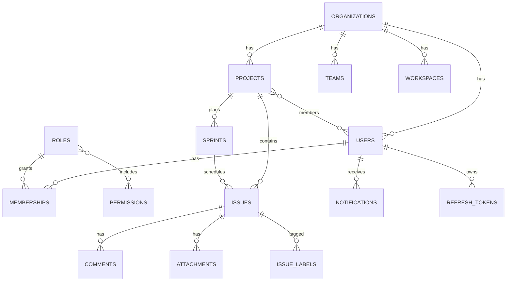

# Database ERD

```mermaid
erDiagram
  ORGANIZATIONS ||--o{ USERS : has
  ORGANIZATIONS ||--o{ PROJECTS : has
  ORGANIZATIONS ||--o{ TEAMS : has
  ORGANIZATIONS ||--o{ WORKSPACES : has
  USERS ||--o{ MEMBERSHIPS : has
  ROLES ||--o{ MEMBERSHIPS : grants
  ROLES }o--o{ PERMISSIONS : includes
  PROJECTS ||--o{ ISSUES : contains
  PROJECTS ||--o{ SPRINTS : plans
  PROJECTS }o--o{ USERS : members
  SPRINTS ||--o{ ISSUES : schedules
  ISSUES ||--o{ COMMENTS : has
  ISSUES ||--o{ ATTACHMENTS : has
  ISSUES ||--o{ ISSUE_LABELS : tagged
  USERS ||--o{ NOTIFICATIONS : receives
  USERS ||--o{ REFRESH_TOKENS : owns
```

See `database/schema.sql` for constraints, indexes, generated `tsvector` search, and RLS.
